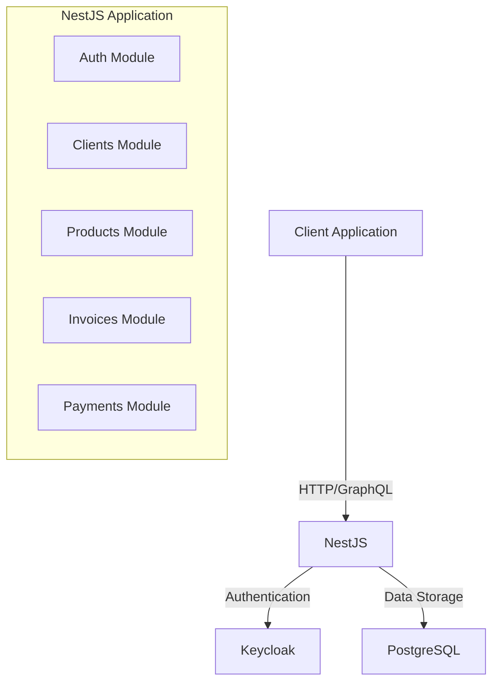

# Invoice Management System

<div align="center">
  
  
  
</div>

## 📋 Overview

A robust, secure invoice management system built with NestJS. This backend application provides both GraphQL and REST endpoints for managing clients, products, invoices, and payments, with Keycloak authentication integration.

## ✨ Key Features

- **🔐 Secure Authentication** with Keycloak
- **📊 GraphQL API** with Apollo Server
- **🌐 REST API** with Swagger documentation
- **🛢️ PostgreSQL** database with TypeORM
- **🐳 Docker** containerization for services

## 🏗️ Architecture



## 🚀 Quick Start

1. **Clone and Install**
   ```bash
   git clone <repository-url>
   cd invoice-management
   npm install
   ```

2. **Configure Environment**
   ```bash
   cp .env.example .env
   # Edit .env with your configuration
   ```

3. **Start Services**
   ```bash
   docker-compose up -d
   ```

4. **Run Application**
   ```bash
   npm run start:dev
   ```

5. **Access APIs**
   - REST API: http://localhost:3000/api
   - GraphQL: http://localhost:3000/graphql
   - Keycloak Admin: http://localhost:8080/admin

## 📚 Module Structure

| Module | Description |
|--------|-------------|
| Auth | Keycloak integration, authentication guards |
| Clients | Client entity management |
| Products | Product catalog management |
| Invoices | Invoice generation and processing |
| Payments | Payment tracking and processing |

## 🛠️ Development

The project includes seeders for development environment that automatically populate:
- Test products
- Sample clients
- Example invoices

## 📝 Documentation

Comprehensive API documentation is available via:
- Swagger UI at `/api` endpoint
- GraphQL Playground at `/graphql` endpoint

## 🔗 Additional Resources

- [NestJS Documentation](https://docs.nestjs.com/)
- [Keycloak Documentation](https://www.keycloak.org/documentation)
- [TypeORM Documentation](https://typeorm.io/)